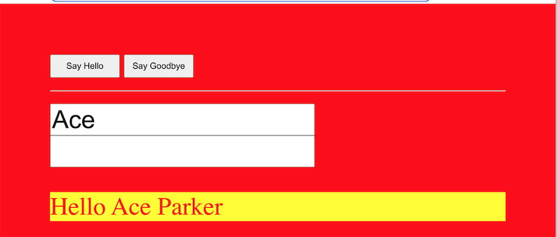
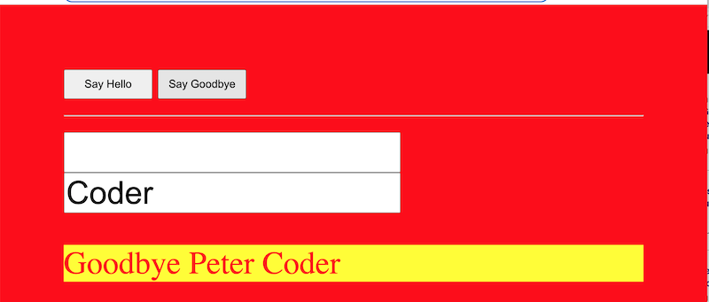
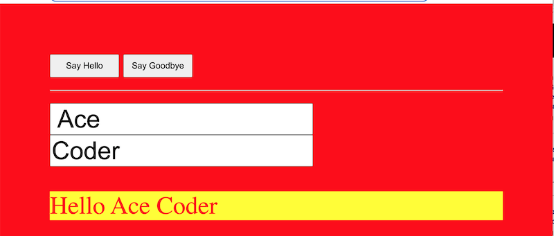

# Greeter-2 

1) Finish up the greeter app from last time:

```js
// 1 - get a reference to the button
// 2 - add a click event to button that calls a `sayHello` function
// 3 - create a `sayHello()` function
// 3A - get name of person from the <input>
// 3B - get a reference to the #output <p>
// 3C - update HTML of #output <p>
```

- Things to note (and try):
  - we can use `button.onclick` OR `button.addEventListener()`
    - these will both point to either a named or anonymous function (which is essentially a "self-contained block of code") that will be executed when the event occurs
    - what happens if we mistakenly put the parentheses after the function reference like this?
      - `button.onclick = sayHello();`
  - `<input>` elements have a `.value` property
  - we can use either string concatenation OR [template strings](https://developer.mozilla.org/en-US/docs/Web/JavaScript/Reference/Template_literals) to create the new string

<hr>

2) More to do:
- Move the `<script>...</script>` tag back up to the `<head>` section and use `window.onload` or `window.addEventListener()` to detect when the page has loaded
- If the user does not enter any text into the `<input>`, then use a default of "Peter" for the first name
  - also use `String.trim()` to get rid of any leading or trailing spaces that the user might have typed in

<hr>

3) Some CSS
- *Declaratively* (using CSS) make the button 50 pixels tall by 150 pixels wide, with a font-size of 14 points
- *Imperatively* (using JavaScript) give the paragraph a `red` text color, and a `yellow` background color
- Add a media query that kicks in at `1024px` or wider:
  - it gives the `<body>` a background-color of `red`
  - it gives the `<body>` 100 pixels of padding
  - be sure to preview this in [Chrome's Device Mode](https://developer.chrome.com/docs/devtools/device-mode/)
- Let's also review how to *embed* a font from [Google Fonts](https://fonts.google.com)
  
<hr>

4) You do the following
- Add a "last name" `<input>` so that we can greet the person using both their first and last names
- Write code that uses a default of "Parker" for the last name if one is not typed in
- Add a new button named "Say Goodbye" that will display "Goodbye <first-name> <last-name>" (instead of "Hello <first-name> <last-name>") when it is clicked
  - You will probably accomplish this by creating a new function named `sayGoodbye()`
  - Give the buttons `id` values (in the HTML) of `"btn-hello"` and `"btn-goodbye"`
- Optional Challenge:
  - Can you get rid of `sayHello()` and `sayGoodbye()` and have each button call a *single function* named `greet()`, that takes a `greeting` parameter - ex. `function greet(greeting){...}`

<hr>

5) Submission
- name the file **lastName-firstInitial-greeter-2.html**
- ZIP and POST it to the myCourses dropbox

<hr>

- **The done version should look like this**
  

  

  

