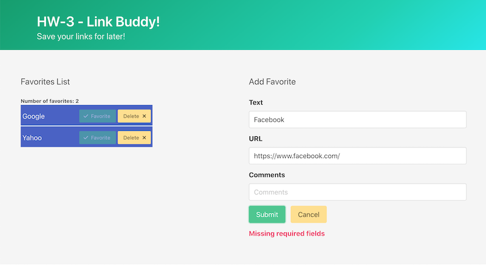

# HW-3 - Link Buddy!

## Overview

## I. Functional Requirements
- **I-A) Add Favorite Form**
  - User types info about a link into 3 form fields - the "clickable" *text*, *url* and *comments* about that link
  - When the user clicks the **Submit** button:
    - the newly submitted favorite will appear on the Favorites List 
    - the number of favorites will be displayed to the user
    - the newly submitted favorite will be added to `.localStorage`
  - If the user clicks the **Submit** button without first providing all 3 values
    - they will be informed via an error message (see example below)
    - a favorite will not be created
  - If the user clicks the **Cancel** button, all 3 form fields will be *cleared* (e.g. `.value=""`)
- **II-B) Favorites List**
  - When the user first loads or re-loads the HTML page, any existing favorites will be loaded in from `.localStorage` and displayed to the user in a list of **Bookmark Components**
- **III-C) Bookmark Component**
  - Contains a functional hypertext link that displays the name of the favorite, as has tooltip text that displays that favorite's comments
    - Clicking the link will open the url in a new window
  - Has a **Favorite** button that is disabled
  - Clicking the **Delete** button:
    - Removes that component from the Favorites List
    - Removes that favorite from `.localStorage`

## II. Screenshot

## III. Code Requirements & Rubric

## IV. Hints and Tips
- **favorite.js**
  - contains `class Favorite{...}` 
    - is a *model class* that has `fid` (stands for "favorites ID"), `text`, `url` and `comments` properties
    - NB - generally, a *model class* is a data structure we use to define the "shape" of our application data
      - in Java or JavaScript or C# you would likely use a `class`
      - in TypeScript you would likely use an `interface`
    - when you create a new `Favorite instance`, give it a unique `fid`
- **myBookmark.js**
  - contains `class MyBookmark extends HTMLElement{...}`
    - is a component class that displays the information for 1 favorite
    - has the following *properties*: `_fid`, `_text`, `_url` and `_comments`
    - has the following *attributes*: `data-fid`, `data-text`, `data-url` and `data-comments` 
- **main.js**
  - contains the coding logic that:
    - calls methods in **localStorage.js** that will load in stored favorites
    - creates instances of `MyBookmark` components and appends them to the HTML page
    - deletes instances of `MyBookmark` components and removes them from the HTML page
    - displays the number of favorites for the user
    - calls methods in **localStorage.js** to update the list of favorites
    - handles form submission and data validation when creating new favorites
- **localStorage.js**
  - contains methods for reading from/writing to `localStorage`

## V. FAQ

1) How much validation of the form data is required? For example, do we have to determine that the url is legal and well-formed? 

    - In a shipping application (or portfolio pice) it is essential to do extensive validation of the form data before it is sent to `createFavorite()` - for example, that the url is valid and functional
    - However, the only requirement for this HW is that you verify that after a `string.trim()` is performed on the input, each of the 3 fields has provided a 1-character length string or longer
  

## VI. Submission

- Put the files from above into a parent folder named ***lastName*-*firstInitial*-hw3**
  - (-5%) for a misnamed folder
- ZIP the folder and post to myCourses

<!--
## XX. Rubric

- **I. Refactor the code to our course coding standards**
  - (-2%) per code style violation
- **II. User Experience Requirements - 35%**
- **III. Code Requirements - 35%** 
- **IV. App Data requirements - 15%**
- **V. Aesthetic Requirements - 0%-15%**
- **VI. Documentation Requirements**
  - (-10%) if not done
- ***Starting point is NOT PE-06 Audio Visulizer - (-100%)***

## IX. Submission

- Put the files from above into a parent folder named ***lastName*-*firstInitial*-hw3**
  - (-5%) for a misnamed folder
- ZIP the folder and post to myCourses

-->

