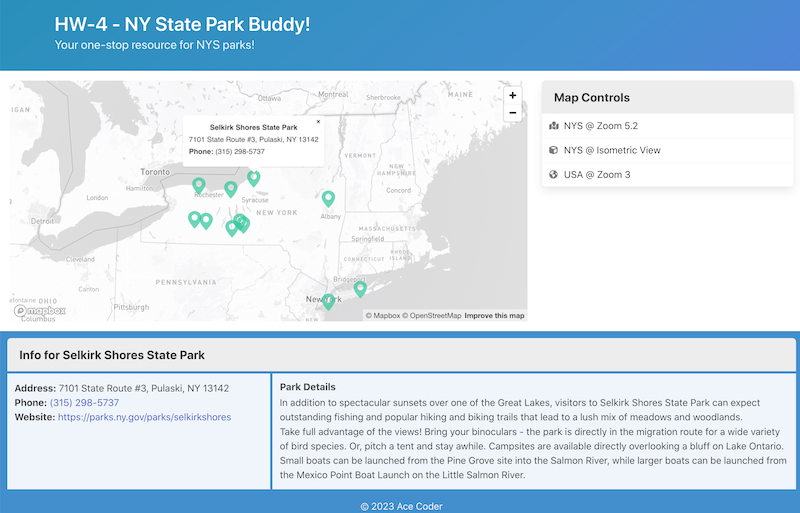

# HW-4 Starter 
## *(Not done yet! - I will send out a Slack message Sunday night when it is!)*

## I. Download the start files
- Rename the folder to ***lastName*-*firstInitial*-hw4**
- Look over the HTML/CSS/JS files to be sure that you understand the structure of the app
- Add your Mapbox API key to **map.js**
- Change the name and year in the HTML footer to appropriate values
- Reload the HTML page - the map should be displaying now
  - note the helpful zoom controls we added to the upper-right corner of the map
  - the user can also use their mouse to pan the map and zoom in and out


<hr>


<hr>

## II. Get the buttons working
- We are going to add a [Bulma "panel"](https://bulma.io/documentation/components/panel/) and 3 buttons to the right column of the page. These buttons will allow the user to control the viewable area of the map

### II-A. The HTML for the buttons looks like this:

- Make these changes in **index.html**


<hr>

### II-B. The JS for the buttons looks like this:

- Make these changes in **main.js**


<hr>

- And go ahead and call `setupUI()` at the bottom of `init()`
- When you are done the buttons should function and the map should look like this

<hr>


<hr>

## III. Add Markers to the map

- Let's go ahead and write the code that will add State park *markers* to the map
- These markers will display a popup when clicked
- They will also (very soon) display other information about each park, in the "Info" section of the HTML page

### III-A. Implement the `addMarker()` helper function
- The following code goes in the "private" section of **map.js**


<hr>

### III-B. Test the `addMarker()` helper function

- Put the following test code into the end of the `initMap()` function in **map.js**
- We are using the "features" data for Letchworth park - `geojson.features[0]` - which is hard-coded onto **map.js** as test data


```js
// test
const clickHandler = (id) => alert(`${id} was clicked!`);
addMarker(geojson.features[0], "poi", clickHandler);
```

<hr>

- When you are done there should be a single marker that looks like the screenshot below
- Clicking the marker will show the popup and also run our test `clickHandler`, which "alerts" the `id` of the marker to a browser modal dialog box

<hr>


<hr>

### III-C. DO THIS

- Add the park phone number to the popup:
  - modify the marker HTML
  - pull the `.phone` property from the feature
  - it should look similar to the screenshot below
  - ***PS - Once you have confirmed everything works, "comment out" or delete the test code from `initMap()`***

<hr>


<hr>

## IV. Load the park data from a JSON file

### IV-A. Declare a variable to hold the JSON

- In the "Variables & Constants" section of **main.js**, declare a `geojson` variable

```js
let geojson;
```

<hr>

### IV-B. Load the JSON file

- Let's go ahead and load the **data/parks.geojson** file and log it out to the console
- Make `init()` in **main.js** look like the following:

<hr>


<hr>

- Reload the page, and open the console, you should see the contents of **parks.geojson** logged out
- What you are inrterested in is the `features` array - which is the array that contains all of the NYS park data

<hr>


<hr>

### IV-C. Head over to map.js

- In **map.js**, in the "public" section, implement the `addMarkersToMap()` function, and `export` it
- ***Don't forget to `export` it!***

<hr>


<hr>

### IV-D. Head back to main.js

- In **main.js**, we are going to call `addMarkersToMap()` in the ajax callback function - right after the JSON is loaded, but before `setupUI()` is called

<hr>


<hr>

- Note that we have not yet implemented `showFeatureDetails()` - this will be the function that is called when each marker is clicked
- Here is the starter implementation of `showFeatureDetails()` (this goes in **main.js**):

```js
const showFeatureDetails = (id) => {
	console.log(`showFeatureDetails - id=${id}`);
};
```

- Go ahead and reload the page and test the code
  - all the parks in the JSON file should have markers on the map
  - clicking a marker should give you a popup showing the park name, address and phone humber
  - when a marker is clicked, you should also see a log in the console:
    - something like - `main.js:36 showFeatureDetails - id=p84`
    - which is the `showFeatureDetails()` function above, getting called when the marker in clicked on
  
<hr>


<hr>

## V. Showing feature details when a marker is clicked on

- When a marker is clicked on, we want to show the park name, address, phone number and description in the "Info" row of the app
- To do this, we will need to write code that searches the `features` array for the park that matches the `id` of the marker that was clciked on 

### V-A. Add HTML for the bottom "Info" row

- Make the bottom row (the one right above `<div class="footer" ...`. shown below) appear as below
- NB - when you are done, you may wish to validate your HTML to help determine if you typed it in properly

<hr>


<hr>

### V-B. Keep working on `showFeatureDetails()`

- Here are the next 2 lines of code for `showFeatureDetails()`

```js
const feature = getFeatureById(id);
document.querySelector("#details-1").innerHTML = `Info for ${feature.properties.title}`;
```

- **DO THIS** - Note that we did not give you the implementation of the `getFeatureById(id)` function - so go ahead and implement that yourself:
  - you need to "search" the `geojson.features` array for the park feature (object) that has a `.id` that matches the passed in `id` argument, and `return` it
  - an optimal solution uses `array.find()` and can be done in one line of code (but get it working however you can)
- Once you have it properly working, you should see the "Info" row displaying the name of the park that was just clicked on

<hr>


<hr>


### V-C. DO THIS - Complete `showFeatureDetails()`

- Go ahead and get `#details-2` displaying the clicked park's address, phone number, and web site:
  - the website must be a clickable link
  - the phone number must also be a clickable link - use the `tel:` protocol - google it if you are not familiar with how to use it
- Get `#details-3` displaying the clicked park's description
- See example screenshot below

<hr>



<hr>
