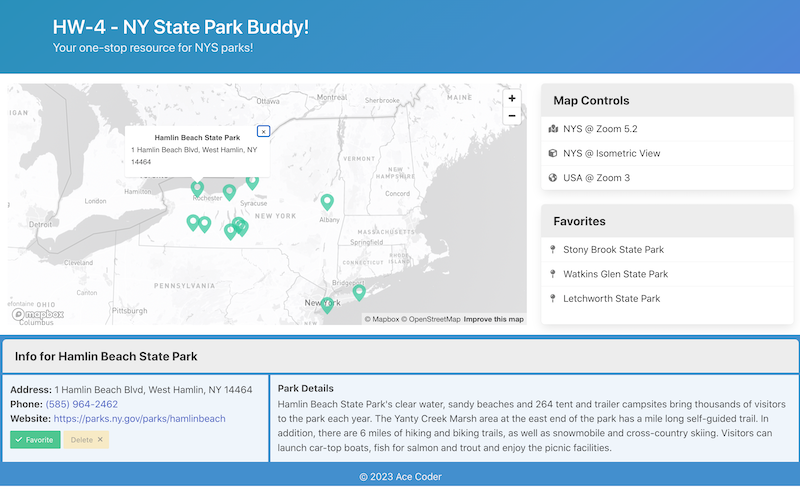

# HW-4 - *NY State Park Buddy* (DRAFT)

## Overview
- NYS Park Buddy allows the user to:
  - view NYS parks as markers on a map
  - click on the markers to view more information about the park
  - favorite and unfavorite parks and have this list preserved in `.localStorage`

## I. Complete the starter exercise

- Head to [HW-4 - NY State Park Buddy - Starter](hw-4-starter.md) and complete the exercise
- Make a copy of the ***lastName*-*firstInitial*-hw4-starter** folder and rename it to ***lastName*-*firstInitial*-hw4**

## II. Functional Requirements

  **II-A) HW-4 starter has been completed and works perfectly**

  **II-B) The user can "favorite" and "unfavorite" parks by clicking "Favorite" and "Delete" buttons**
  
  - The Favorites panel will be immediately updated with these changes
  - Parks can only appear on the favorites list ONCE
  - The *state* of the "Favorite" and "Delete" buttons must be consistent
    - if the currently selected park is already a favorite, only the "Delete" button should be enabled
    - if the currently selected park is NOT a favorite, only the "Favorite" button should be enabled
    - if no park is selected, neither button should be enabled (or they could be hidden with `display: none`)

  **II-C) User favorites are preserved in `localStorage` so that when the user reloads the page the contents of the Favorites panel are preserved**

## III. Screenshots

- Initial page load - favorites are loaded in from `.localStorage` and shown on the right in the "Favorites Panel"

- After a park (Hamlin Beach) is selected, the info is displayed
- Note the *state* of the buttons - because Hamlin beach is NOT a favorite, the "Add Favorite" button is *enabled* & the "Delete" button is *disabled*

## IV. Rubric

**i. HW-4 starter has been completed and works perfectly (65%)**

**ii. Favoriting/unfavoriting works as described above (15%)**

**iii. Favorites saved to localStorage as described above (10%)**

**iv. Web Component requirement (10%)**

- `<header>` code is moved into a web component
  - web component is in its own JS file
  - web component uses slots to accept title and subtitle data
- `<footer>` code is moved into a web component
  - web component is in its own JS file
  - web component uses slots to accept title and subtitle data

**v. Follow course coding standards**
  - [Course Code Style Requirements](../notes/code-style-required-330.md)
    - (-3%) per code style violation
  - For this HW you must use ES6 arrow functions (-3% per regular `function`)
  - Also:
    - Encapsulation - Limit direct access to your module's variables
    - Separation of concerns - keep each JS module focused on particular task(s) - example:
    - D.R.Y. - "Don't repeat yourself" - factor out repeated code into functions or methods

**vi. Do your own work, and follow RIT's Academic Integrity Policy**
  - Violations of this policy could result in an F in the course

## V. Hints and Tips (check back frequently - might be updated as needed)

## VI. FAQ & Errata (check back frequently - might be updated as needed)

## VII. Submission

- Put the files from above into a parent folder named ***lastName*-*firstInitial*-hw4**
  - (-5%) for a misnamed folder
- ZIP the folder and post to myCourses
