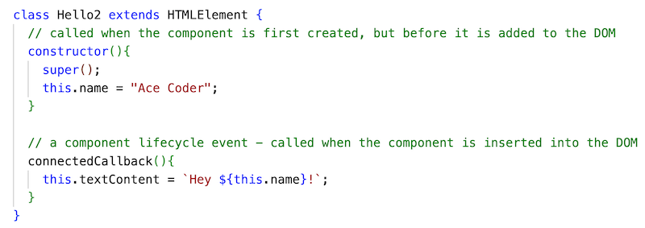
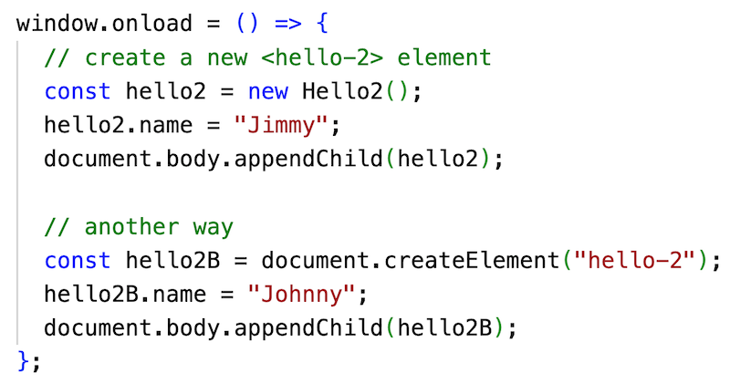
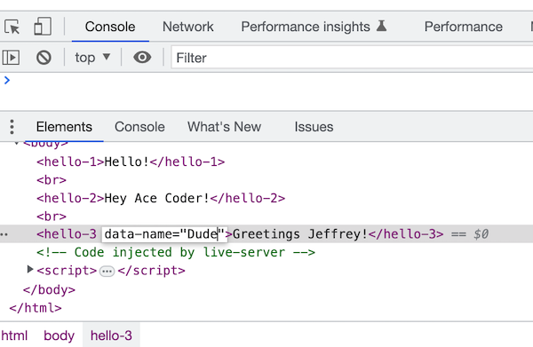
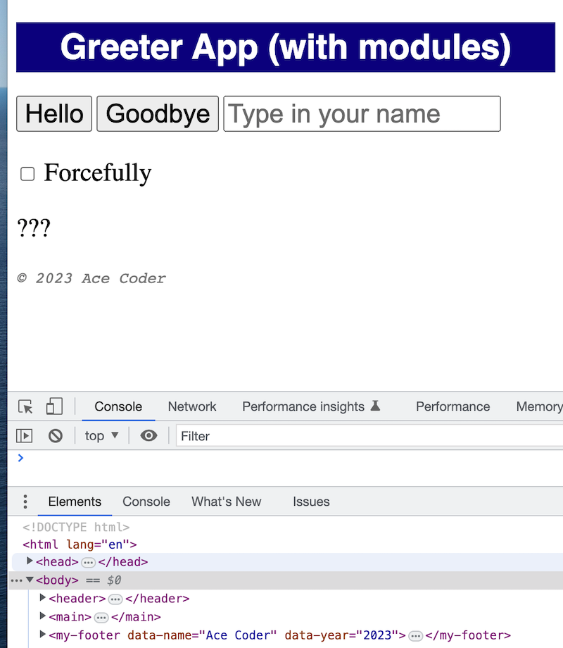

# Web Components-1 - Intro to Web Components

## I. About Web Components

- Modern web developers often utilize front-end frameworks like [React](https://reactjs.org/), [Angular](https://angular.io/) or [Vue.js](https://vuejs.org/) to develop rich user interfaces
- These 3rd party frameworks allow developers to break their user interfaces (written in HTML/CSS/JS) into reusable *components* such as search boxes, interactive product lists, site headers/footers/naviation systems, and so on. These component contain (encapsulate) the HTML tags, CSS and JS that the component needs to function
- The major disadvantage of using 3rd party frameworks to design web sites are:
  - your framework specific code will likely go obsolete fairly quickly, which makes ongoing maintenance of a site time-consuming and expensive
  - most of these frameworks are dependent on 3rd party tooling to transform the code from the framework's proprietary syntax (for example, React's `JSX`), into a form that the browser can understand (standard HTML/CSS/JS)
- *Web Components* have been standardized for all of the major browsers, and will function "out of the box" without any required third-party tooling:
  - https://developer.mozilla.org/en-US/docs/Web/Web_Components
  - https://www.webcomponents.org/introduction
  - https://css-tricks.com/an-introduction-to-web-components/
 - Web Components consist of 3 major technologies that are used together:
   - ***Custom Elements*** - a way that we can define our own custom DOM elements (tags), and to also extend built-in elements
     - *"Custom elements provide a way for authors to build their own fully-featured DOM elements. Although authors could always use non-standard elements in their documents, with application-specific behavior added after the fact by scripting or similar ..."* - https://html.spec.whatwg.org/multipage/custom-elements.html#custom-elements
    - ***Shadow DOM*** - encapsulates HTML/CSS - style rules, class names etc are scoped to the component
      - https://developers.google.com/web/fundamentals/web-components/shadowdom
    - ***HTML Templates***
      - *"The `<template>` element is used to declare fragments of HTML that can be cloned and inserted in the document by script."* - https://html.spec.whatwg.org/multipage/scripting.html#the-template-element
 - Web Components are supported natively on all modern browsers, and can be used on older browsers with a [*polyfill*](https://developer.mozilla.org/en-US/docs/Glossary/Polyfill):
   - https://www.webcomponents.org/polyfills
   - https://github.com/webcomponents/polyfills/tree/master/packages/webcomponentsjs
   - https://cdnjs.cloudflare.com/ajax/libs/webcomponentsjs/2.6.0/webcomponents-bundle.js

<hr>

## II. Overview of a web component

- To create a custom HTML element, you first need to extend the `HTMLElement` class
- You may wish to add a `constructor` and initialize some properties (if you do, don't neglect to call `super()`!)
- You then add in some or all of these component *lifecycle* methods
  - `connectedCallback()` - called when the component is inserted into the DOM
  - `disconnectedCallback()` - called when the component is removed from the DOM
  - `attributeChangedCallback()` - called each time one of the component's "watched" attributes changes
  - `static get observedAttributes()` - specifies which attributes we want to be notified when their values change


```html
<script>
// Create a class and extend HTMLElement
class MyElement extends HTMLElement{
  // #1 - constructor called when instance of this class is created
  constructor(){
    super();
    // setup
  }
  
  // #2 - called when the component is inserted into the DOM
  connectedCallback(){
    // draw page
    this.render();
    // we could also hookup some JavaScript to DOM events
  }
  
  // #3 - called when the component is removed from the DOM
  disconnectedCallback(){
    // a good place to clean up, remove event listeners, etc ...
  }
  
  // #4 - this lifecycle method is invoked each time one of the component's "watched" attributes changes
  attributeChangedCallback(attributeName, oldVal, newVal){
    console.log(attributeName, oldVal, newVal);
    this.render();
  }
  
  // #5 - here were specify for which attributes we want to be notified when their values change
  static get observedAttributes(){
    return ["data-year", "data-text"];
  }
		
  // #6 - a helper method (could be named anything) to display the values of the attributes
  render(){
    // update the DOM in some way based on the value of the attributes
  }
  
} // end class

// #7 - define our new custom element with `customElements.define()` so that we can use it on the page
customElements.define('my-element', MyElement);
	
</script>
...
<body>
  <!-- Use it! -->
  <my-element></my-element>
  ...
</body>
```

- ***Note that custom element names MUST be all lower case letters, and MUST have a dash in the name (in order to distinguish them from built-in element names)***
- FYI - here is Google's Web Component style guide - https://github.com/GoogleWebComponents/style-guide

<hr>

## III. Get Started

**hello-wc.html**

```html
<!DOCTYPE html>
<html lang="en">
<head>
  <meta charset="UTF-8">
  <meta http-equiv="X-UA-Compatible" content="IE=edge">
  <meta name="viewport" content="width=device-width, initial-scale=1.0">
  <title>Web Components - Hello</title>
  <style>
    /* Note that we can style custom elements just like any other built-in element such as a <p>, <h1> etc*/
    hello-1{
      font-weight: bold;
      color: red;
      border: 1px dashed black;
      padding: 2px;
    }
  </style>
  <script>
  class Hello1 extends HTMLElement{
    // a component lifecycle event - called when the component is inserted into the DOM
    connectedCallback(){
      this.textContent = "Hello!";
    }
  }
  </script>
</head>
<body>

</body>
</html>
```

<hr>

- Create this file and load it in the browser to be sure that there are no errors
- So how do we use this web component?
- First, add the following to the bottom of the `<script>` tag:
  - `customElements.define('hello-1', Hello1);`
  - https://developer.mozilla.org/en-US/docs/Web/API/CustomElementRegistry/define
    - this method tells the browser there's a new custom element (meaning a "tag") named `<hello-1>` it might have to render
    - and that this element is defined by the `Hello1` class
- Second - add `<hello-1></hello-1>` to the `<body>`
- Reload the page and you should see "Hello" rendered out (with the CSS styles applied)

<hr>

## IV. Add a `constructor` and a `name` property

- Create a new class named `Hello2` - it looks like this:



- Go ahead and ..
  - register `Hello2` with the browser - and name the custom element `hello-2`
  - modify the CSS so that it is styled the same as `<hello-1>` is
  - add a `<br>` tag and this new element to the `<body>` tag
- You should now see "Hey Ace Coder!" in the browser window (with the CSS styles applied)

<hr>

## V. Create an instance of `<hello-2>` dynamically using code

- Here's how to use JS to create new custom elements, modify their properties, and add them to the DOM - go ahead and add the following code to the bottom of the `<script>` tag



- You should now see "Hey Jimmy!" and "Hey Johnny!" in the browser window (with the CSS styles applied)
- Now go ahead and comment out that "creation" code and move on

<hr>

## VI. Using attributes to pass values into a component
- Create a new class named `Hello3`
- See below that we are now watching for changes to a `data-name` attribute and then:
  - updating the `this.name` property
  - calling the `render()` helper function and updating the DOM 
- Note that we are following the [HTML5 custom data](https://developer.mozilla.org/en-US/docs/Learn/HTML/Howto/Use_data_attributes) naming conventions by calling the attribute `data-name` rather than `name`, so that we don't get identifier collisions with existing HTML attributes


- Go ahead and ..
  - register `Hello3` with the browser - and name the custom element `hello-2`
  - modify the CSS so that it is styled the same as the other tags
  - add a `<br>` tag and this new element to the `<body>` tag
- You should now see "Greetings Ace Coder!" in the browser window (with the CSS styles applied)
- Now modify the tag so that you pass in a `data-name` attribute

```js
<hello-3 data-name="Jeffrey"></hello-3>
```

- Reload the page - you should now see "Greetings Jeffrey!" in the browser window (with the CSS styles applied)
- Look over the code, open up the console, reload the page, look for the log, and be sure that you understand what methods are being called when 

<hr>

## VII. Editing attributes in the web inspector

- Open up the web inspector and change the value of `data-name` to something else
- You should see a log to the console, and an update in the browser window



<hr>

## VIII. Add a boolean attribute

- Add `"data-shout"` to the array of observed attributes (see the `observedAttributes()` static getter)
- Add the following to the end of `render()`:

```js
if(this.hasAttribute("data-shout")){
  this.textContent = this.textContent.toUpperCase();
}
```
- Then add another `<hello-3>` tag to the page

```js
<hello-3 data-name="Janet" data-shout></hello-3>
```

- Reload the page - you should see "GREETINGS JANET!" in the browser

<hr>

- You can also set the attribute values programmatically - put this at then end of `window.onload`

```js
// get first <hello-3> on the page
// PS - the second "data-shout" is a convention for boolean attributes
document.querySelector("hello-3").setAttribute("data-shout","data-shout");
```

- Reload the page - you should now see "GREETINGS JEFFREY!" in the browser

<hr>

## IX. Check it off!
- Grab [greeter-modules.zip](./_files/greeter-modules.zip) and unzip it
- Rename the folder to ***lastName*-*firstInitial*-wc-1** (-5% if named incorrectly)
- Create a `my-footer` custom element that has `data-name` and `data-year` custom attributes
- Add a `<my-footer>` element to the page, with the appropriate attribute values (use your name and the current year)
- Once it's working:
  - move the component code (including the code that registers the component) to a JS file named **src/myFooter.js**
  - in **greeter.html** add a `<script>` tag so that the browser knows about this custom component
    - `<script src="src/myFooter.js"></script>`
  - (-20%) if component code is not in an external file
- When you are done, the Greeter app should appear similar to the screenshot below
- Also put the completed **hello-wc.html** file (completed through part VIII) into the ***lastName*-*firstInitial*-wc-1** folder (-25% if not done)
- ZIP up the ***lastName*-*firstInitial*-wc-1** folder and post it to myCourses

<hr>



