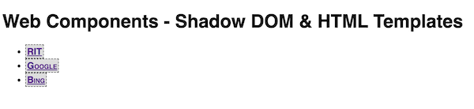

# Web Components-2 - Shadow DOM and HTML Templates

## *PSA - Name your components and attributes properly*

- Custom *element names* MUST have a dash in them:
  - YES! - `<my-header>`
  - NO! - `<myHeader>`
  - https://developer.mozilla.org/en-US/docs/Web/Web_Components/Using_custom_elements#high-level_view
- Custom *element attribute names* (those that start with `data-`) MUST be all lower case:
  - YES! - `<my-header data-subtitle="Intro"></my-header>`
  - NO! - `<my-header data-subTitle="Intro"></my-header>`
  - https://html.spec.whatwg.org/multipage//dom.html#embedding-custom-non-visible-data-with-the-data-*-attributes

<hr>

## I. Start Code

- Create this file and open it up in the browser
- Test it - the links should be "clickable"
- Look over the code and be sure that you understand how it works
- **DO THIS:** - Add a new `<my-bookmark>` and `<li>` to the bottom of the `<ul>` - in the HTML - have it link to the *MDN Web component docs* (use google to get the link)

**wc-2.html**

```html
<!DOCTYPE html>
<html lang="en">
<head>
  <meta charset="UTF-8">
  <meta http-equiv="X-UA-Compatible" content="IE=edge">
  <meta name="viewport" content="width=device-width, initial-scale=1.0">
  <title>Web Components - Shadow DOM & HTML Templates</title>
  <style>
    body{
      font-family: sans-serif;
    }
    /* Note that we can style custom elements just like any other built-in element such as a <p>, <h1> etc*/
    my-bookmark{
      border: 1px dashed black;
      padding: 2px;
    }
  </style>
  <script>


  class MyBookmark extends HTMLElement {
    // called when the component is first created, but before it is added to the DOM
    constructor(){
      super();
      this._text = "RIT";
      this._url = "https://www.rit.edu/";
    }

    // tell the component what attributes to "watch"
    static get observedAttributes() {
      return ["data-text", "data-url"];
    }

    // ** lifecycle events **

    // called when the component is inserted into the DOM
    connectedCallback(){
      this.render();
    }

    // this method is invoked each time one of the component's "watched" attributes changes
    attributeChangedCallback(attributeName, oldValue, newValue) {
      console.log(attributeName, oldValue, newValue);
      if(oldValue === newValue) return;
      if(attributeName == "data-text"){
        this._text = newValue;
      }
      if(attributeName == "data-url"){
        this._url = newValue;
      }
      this.render();
    }

    // helper method
    render(){
      this.innerHTML = `<span><a href="${this._url}">${this._text}</a></span>`;
    }
  }

  customElements.define('my-bookmark', MyBookmark);

  window.onload = () => {
    // Create a MyBookmark and add it to the list
    const bing = document.createElement("my-bookmark");

    // ANOTHER way to set custom attributes, the .dataset property
    // note that these 2 lines of code will also trigger attributeChangedCallback()
    bing.dataset.text = "Bing";
    bing.dataset.url = "https://www.bing.com/";

    const newLI = document.createElement("li");
    newLI.appendChild(bing);
    document.querySelector("#bookmarks").appendChild(newLI);
  };

  </script>
</head>
<body>
  <h1>Web Components - Shadow DOM & HTML Templates</h1>
  <ul id="bookmarks">
    <li><my-bookmark></my-bookmark></li>
    <li><my-bookmark data-text="Google" data-url="https://www.google.com/"></my-bookmark></li>
  </ul>
</body>
</html>
```

<hr>

## II. The Shadow DOM & `<template>` element
- ***Shadow DOM*** - encapsulates HTML/CSS - style rules, class names etc are scoped to the component
  - https://developers.google.com/web/fundamentals/web-components/shadowdom
  - Althought the *Shadow DOM* sounds kind of mysterious, it is simply a "scoped" DOM that components have that is separate from the main DOM of the document. 
  - For example, if our component had an `<h1>` in it,  and we wrote a `document.querySelector("h1")` call, or wrote a style rule like this `h1{color:red}` - our component's `<h1>` would be unaffected
  - From [MDN/Web_Components/Using_shadow_DOM](https://developer.mozilla.org/en-US/docs/Web/Web_Components/Using_shadow_DOM):
    - *... none of the code inside a shadow DOM can affect anything outside it, allowing for handy encapsulation*
    - *Note that the shadow DOM is not a new thing by any means — browsers have used it for a long time to encapsulate the inner structure of an element. Think for example of a `<video>` element, with the default browser controls exposed. All you see in the DOM is the `<video>` element, but it contains a series of buttons and other controls inside its shadow DOM. The shadow DOM spec has made it so that you are allowed to actually manipulate the shadow DOM of your own custom elements.*
  - https://blog.revillweb.com/open-vs-closed-shadow-dom-9f3d7427d1af
- ***HTML Templates***
  - *"The `<template>` element is used to declare fragments of HTML that can be cloned and inserted in the document by script."* - https://html.spec.whatwg.org/multipage/scripting.html#the-template-element


<hr> 

## III. Creating a `<template>` and Shadow DOM

- A) Add the following right ***before*** the `MyBookmark` class definition


- B) Add the following to the bottom of the `MyBookmark` constructor:


- C) Modify `render()` to look like this:


<hr>

- D) Reload the page - now the bookmarks are using their built-in HTML and styles from the template!



<hr>

- E) To see how the Shadow DOM of the `my-bookmark` components is encapsulated/protected, try running this line of code in `window.onload`:

```js
document.querySelector("span").innerHTML = "ZZZ";
```

- ***It will fail because the `<span>`s are all hidden inside of the `my-bookmark` instances shadow DOM!***

<hr>

## IV. Move the code to modules

1) Make a copy of **wc-2.html** and name it **wc-2-modules.html**
    - be sure that you keep a copy of **wc-2.html**, you might need it in the future

2) Create a folder named ***lastName*-*firstInitial*-wc-2** and put **wc-2-modules.html** into it

3) Create a folder named **src** inside of ***lastName*-*firstInitial*-wc-2**

4) Create a JS file in **src/** folder - **myBookmark.js**

5) Move the following code into **myBookmark.js**
    - the `template`
    - the `MyBookmark` class
    - the `customElements.define(...)` code
    - don't forget to `export` the `MyBookmark` class

6) Create a JS file in **src/** folder - **main.js**

7) **main.js**
    - move the `window.onload = ...` code into it
    - add this to the top of **main.js** - `import { MyBookmark } from "./myBookmark.js";`

8) In the HTML file, go ahead and link to **main.js**
    - `<script src="src/main.js" type="module"></script>`

- **Test your app, it should work the same as before**

<hr>

## V. Check it off
1) In **wc-2-modules.html**, delete all of the `<my-bookmark>` elements - and associated `<li>` elements - from the `<ul>`

2) In **main.js**, comment out (but don't delete, you might need some of it) all of the code inside of the `window.onload` handler
  
3) Add the following to the top of **main.js**, right after the `import` statement:

```js
const bookmarks = [
  {
    text: "Bing",
    url: "https://www.bing.com",
    comments: "Bing is a web search engine owned and operated by Microsoft."
  },
  {
    text: "Google",
    url: "https://www.google.com",
    comments: "Google Search is a search engine provided and operated by Google."
  },
  {
    text: "DuckDuckGo",
    url: "https://duckduckgo.com/",
    comments: "DuckDuckGo (DDG) is an internet search engine that emphasizes protecting searchers' privacy."
  }
];
```

4) Your mission is use the data contained in the `bookmarks` array above to populate `<ul id="bookmarks">` 

    - Write the necessary code in the `window.onload = ...` event handler
    - You will be dynamically creating `<my-bookmark>` and `<li>` elemets and adding them to `<ul id="bookmarks">` 
    - When you are done, it should look like this (and make sure that the links all function):

<hr>


<hr>

5) Once you have that working, modify the `MyBookmark` class:
    - add a `_comments` property to the constructor and set its default value to "No comments found"
    - write the code necessary to handle a `"data-comments"` attribute
    - we want the value of `"data-comments"` will show up as a *tooltip* - meaning you will need to set the built-in `.title` attribute of the `<a>` tag to the value of `_comments`
    - in **main.js**, set that attribute's value to the appropriate value for each bookmark
    - when you are done, it should look like this (and make sure that the tooltip text is all correct):

<hr>


<hr>

## VI. Submission

- Zip the ***lastName*-*firstInitial*-wc-2** folder and post it to myCourses


<hr><hr>

| <-- Previous Unit | Home | Next Unit -->
| --- | --- | --- 
|  [**Web Components I**](wc-1.md)  |  [**IGME-330**](../README.md) | [**Web Components III**](wc-3.md) 
