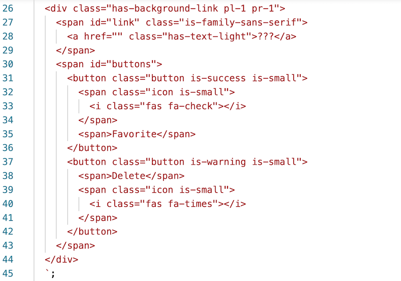

# Web Components-3 - Adding Bulma support / Interactive components

## I. Adding Bulma to a component

#1 - First, rename a folder and a file from [**wc-2**](./wc-2.md):
    - make a copy of ***lastName*-*firstInitial*-wc-2** from last time and name it ***lastName*-*firstInitial*-wc-3**
    - rename **wc-2-modules.html** to **wc-3-modules.html**
    
    
#2 - In **myBookmark.js**, modify `template.innerHTML = ...` to look like the screenshot below:

- The first link in the screenshot below is to Bulma, so here's the link for your copy/paste pleasure: 
  - `<link rel="stylesheet" href="https://cdn.jsdelivr.net/npm/bulma@0.9.4/css/bulma.min.css">`
  - Bulma Docs: https://bulma.io/documentation/
- The second link in the screenshot below is to the Font Awesome library, so here's the link for your copy/paste pleasure:
  - `<link rel="stylesheet" href="https://cdnjs.cloudflare.com/ajax/libs/font-awesome/6.4.0/css/all.min.css" crossorigin="anonymous" referrerpolicy="no-referrer">`
  - Font Awesome Docs: https://fontawesome.com/icons
  - Bulma / Font Awesome examples:
    - https://bulma.io/documentation/elements/icon
    - https://bulma.io/documentation/elements/button/ (scroll down to "With Font Awesome icons")
    - https://www.geeksforgeeks.org/bulma-icon-font-awesome-variations/
    - https://www.geeksforgeeks.org/bulma-input-with-font-awesome-icons/
- NB: Here are latest CDN links for Bulma & Font Awesome:
  - https://cdnjs.com/libraries/bulma
  - https://cdnjs.com/libraries/font-awesome

- ***There is A LOT of vanilla CSS and use of Bulma classes in the HTML/CSS above - we will talk about these in class**
  - https://bulma.io/documentation/helpers/typography-helpers/#font-family

## II. Make some changes to index.html

-  https://bulma.io/documentation/elements/title/

