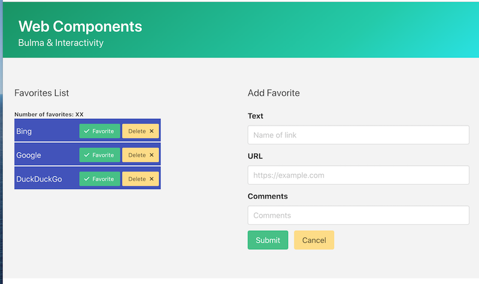

# Web Components-3 - Adding Bulma support

<hr>

## I. Adding Bulma to a component

#1 - First, rename a folder and a file from [**wc-2**](./wc-2.md):
    
  - make a copy of ***lastName*-*firstInitial*-wc-2** from last time and name it ***lastName*-*firstInitial*-wc-3**
  - rename **wc-2-modules.html** to **wc-3-modules.html**
    
    
#2 - In **myBookmark.js**, modify `template.innerHTML = ...` to look like the screenshot below:

- The first link in the screenshot below is to Bulma, so here's the link for your copy/paste pleasure: 
  - `<link rel="stylesheet" href="https://cdn.jsdelivr.net/npm/bulma@0.9.4/css/bulma.min.css">`
  - Bulma Docs: https://bulma.io/documentation/
- The second link in the screenshot below is to the Font Awesome library, so here's the link for your copy/paste pleasure:
  - `<link rel="stylesheet" href="https://cdnjs.cloudflare.com/ajax/libs/font-awesome/6.4.0/css/all.min.css" crossorigin="anonymous" referrerpolicy="no-referrer">`
  - Font Awesome Docs: https://fontawesome.com/icons
  - Bulma / Font Awesome examples:
    - https://bulma.io/documentation/elements/icon
    - https://bulma.io/documentation/elements/button/ (scroll down to "With Font Awesome icons")
    - https://www.geeksforgeeks.org/bulma-icon-font-awesome-variations/
    - https://www.geeksforgeeks.org/bulma-input-with-font-awesome-icons/
- NB: Here are latest CDN links for Bulma & Font Awesome:
  - https://cdnjs.com/libraries/bulma
  - https://cdnjs.com/libraries/font-awesome

<hr>


<hr>

- ***There is A LOT of vanilla CSS and use of Bulma classes in the HTML/CSS above - we will talk about these in class**
  - `display: inline-block` - https://www.w3schools.com/css/css_inline-block.asp
  - vertical text alignment - https://www.w3schools.com/css/tryit.asp?filename=trycss_align_line-height
  - `rem` means "The root element's font-size" - https://developer.mozilla.org/en-US/docs/Learn/CSS/Building_blocks/Values_and_units
  - Bulma:
    - https://bulma.io/documentation/helpers/typography-helpers/#font-family
    - https://bulma.io/documentation/elements/button/
    - https://bulma.io/documentation/helpers/color-helpers/#background-color

<hr>

## II. Make some changes to the HTML file

- Reference:
  - https://bulma.io/documentation/elements/title/
  - https://bulma.io/documentation/form/general/
  - https://bulma.io/documentation/columns/basics/

#1 - Go ahead and link to the Bulma and Font Awesome CDNs (see "copy/paste" links above)

#2 - Make the `<title>` of the page "Web Components - Bulma & Interactivity"

#3 - Make your the CSS in your HTML file look like this:

```html
<style>
  #bookmarks{
    list-style-type: none;
    margin-left: 0;
    padding-left: 0;
  }
  #bookmarks li{
    margin-bottom: 2px;
  }
</style>
```

<hr>

- Your favorites list should now look like this


<hr>

#4 - Make your HTML look like this:

<hr>


<hr>

- When you are done, it will look like this
- Tip - use online validators to help find typing errors
  - https://validator.w3.org/
  - https://jigsaw.w3.org/css-validator/
 


<hr>

## III. Submission

- Zip the ***lastName*-*firstInitial*-wc-3** folder and post it to myCourses


<hr><hr>

| <-- Previous Unit | Home | Next Unit -->
| --- | --- | --- 
|  [**Web Components II**](HW-wc-2.md)  |  [**IGME-330**](../README.md) | :-\
