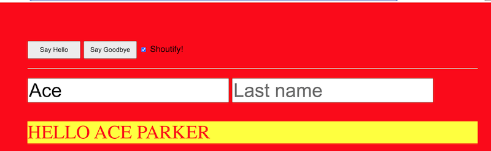

# PE-02 - More Greeter

- In this exercise you will finish up "Greeter"

## I. Meet all the previous requirements 

- See [Greeter-2](../checkoffs/greeter-2.md)
- Be sure to complete ALL of these previous requirements - this means everything from #1-#4 of that assignment
  - ***We didn't mark off for missing requirements last time, but we will this time, so be sure to do everything that's listed***

## II. More Requirements

1) Complete the "Optional Challenge" from Greeter-2:
    - Get rid of `sayHello()` and `sayGoodbye()` and have each button call a single function named `greet()`, that takes a greeting parameter - ex. function `greet(greeting){...}`

2) Add an HTML Checkbox that will "Shoutify" the text (put it in all capital letters) when the user clicks a button and the checkbox is checked
    - see screenshot example below
    - Checkbox docs are here: https://developer.mozilla.org/en-US/docs/Web/HTML/Element/input/checkbox
    - Checkboxes have a `.checked` property
    - Depending on how you write your code, you might want to hook your checkbox into the `onchanged` event 

3) Convert all of the functions in the app to [arrow functions](../notes/js-functions.md#vi-b-arrow-function-examples)

4) Make sure that your HTML and JS is following our [IGME-330 class code standards](../notes/code-style-required-330.md)

## III. Rubric

50% - all previous greeter requirements met

20% - #1 above is complete

30% - #2 above is complete

(-5%) - per "non-arrow" function

(-5%) - per code standard violation

## IV. Screenshot

## V. Submission

- Keep everything in a single HTML file
- name the file **lastName-firstInitial-pe02.html**
- ZIP up and submit to dropbox
