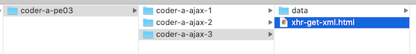

# PE-03 - Review `XHR` & Parsing Text/CSV/XML

- There are quite a few topics covered in this exercise, some are review, and some are new

## I. Loading and parsing text files with `XHR`
- Follow the instructions here:
  - [Ajax-1 - loading and parsing text files](https://github.com/tonethar/IGME-330-Master/blob/master/notes/HW-ajax-1.md)
  - Topics covered:
    - `XHR` review - `XMLHttpRequest` object, `xhr.onload`, `xhr.onerror`, `xhr.open()`, `xhr.send()`, `xhr.responseText`
    - Callback functions and `Event` objects - what `e` and `e.target` are
    - Parsing data with `String.split()`
    - Creating HTML with `array.map()`, `array.join()` and arrow functions
    - Using the Web Inspector (specifically the Elements tab) to see the "live" version of the DOM
  - Make sure that your files are in a ***containing folder*** named  **lastName-firstInitial-ajax-1**

## II. Loading and parsing CSV files with `XHR`
- Follow the instructions here:
  - [Ajax-2 - loading and parsing CSV files](https://github.com/tonethar/IGME-330-Master/blob/master/notes/HW-ajax-2.md)
  - Additional topics covered:
    - working with CSV - Comma Separated Values
    - [array destructuring](https://developer.mozilla.org/en-US/docs/Web/JavaScript/Reference/Operators/Destructuring_assignment) assignment of variables
  - Make sure that your files are in a ***containing folder*** named  **lastName-firstInitial-ajax-2**

## III. Loading and parsing XML files with `XHR`

- Follow the instructions here:
  - [Ajax-3 - loading and parsing XML files](https://github.com/tonethar/IGME-330-Master/blob/master/notes/HW-ajax-3.md)
  - Additional topics covered:
    - authoring custom XML files
    - 5 rules for *well-formed* XML
    - `xhr.responseXML`
    - parsing an XML file
    - writing "guard" code
- Make sure that your files are in a ***containing folder*** named  **lastName-firstInitial-ajax-3**

## IV. Submission
- Put the 3 folders above into a parent folder named **lastName-firstInitial-pe03**
- ZIP and post this to myCourses
- Example:

