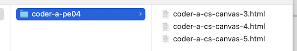

# PE-04 - Canvas Screensaver

## I. Canvas 2D Essential Skills #3 - Begin making a screensaver
- Follow the instructions here: 
  - https://github.com/tonethar/IGME-330-Master/blob/master/notes/3-begin-making-screensaver.md
  - Topics covered:
    - [`window.requestAnimationFrame()`](https://developer.mozilla.org/en-US/docs/Web/API/window/requestAnimationFrame) 
    - Creating a simple canvas helper function
  - Make sure that your file is named ***lastName-firstInitial*-cs-canvas-3.html**

## II. Canvas 2D Essential Skills #4 - Adding Controls
- Follow the instructions here:
  - https://github.com/tonethar/IGME-330-Master/blob/master/notes/4-adding-controls.md
  - Additional topics covered:
    - `<canvas>Fallback text</canvas>`
    - pause/play buttons, checkboxes
  - -5% from overall grade if "spamming the Play button" issue is not fixed
  - -10% for missing pause button functionality
  - -10% for missing "spray paint" functionality
  - -15% for missing "draw rectangles" and checkbox functionality
  - Make sure that your file is named ***lastName-firstInitial*-cs-canvas-4.html**
  - PS - Don't worry about the fact that the button and checkbox are not named according to course standards, that will be correctly by you in a future exercise

## III. Canvas 2D Essential Skills #5 - Write some code!

- Follow the instructions here:
  - https://github.com/tonethar/IGME-330-Master/blob/master/notes/5-write-some-code.md
- Make sure that your file is named ***lastName-firstInitial*-cs-canvas-5.html**
- Rubric:
  - -15% from overall grade for missing "arc drawing" and checkbox functionality
  - -15% for missing "line drawing" and checkbox functionality
  - -10% for each missing helper function
  - -10% for not doing code refactor
  - -5% for missing "clear screen" button functionality
- PS - Don't worry about the fact that the button and checkbox are not named according to course standards, that will be correctly by you in a future exercise

## IV. Submission
- Put the 3 files from above into a parent folder named ***lastName-firstInitial*-pe04**
  - -5% for misnamed files/folders
- ZIP and post this to myCourses
- Example:

